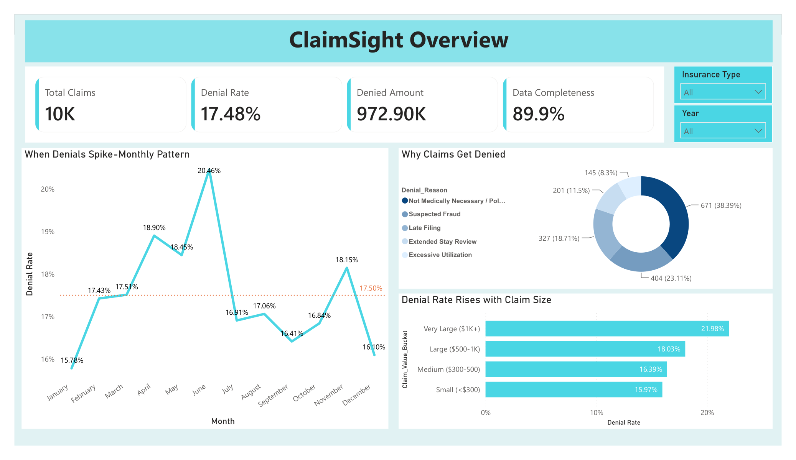
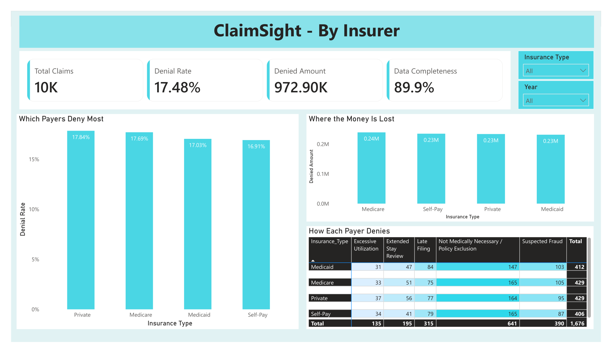
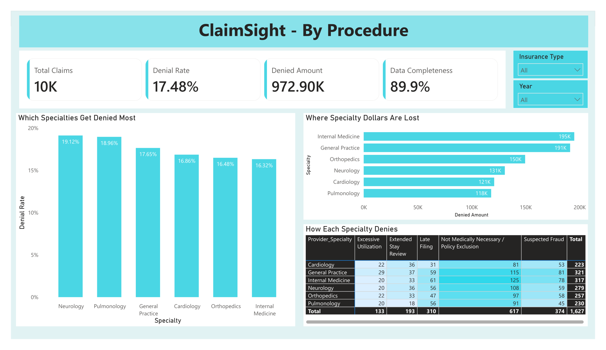
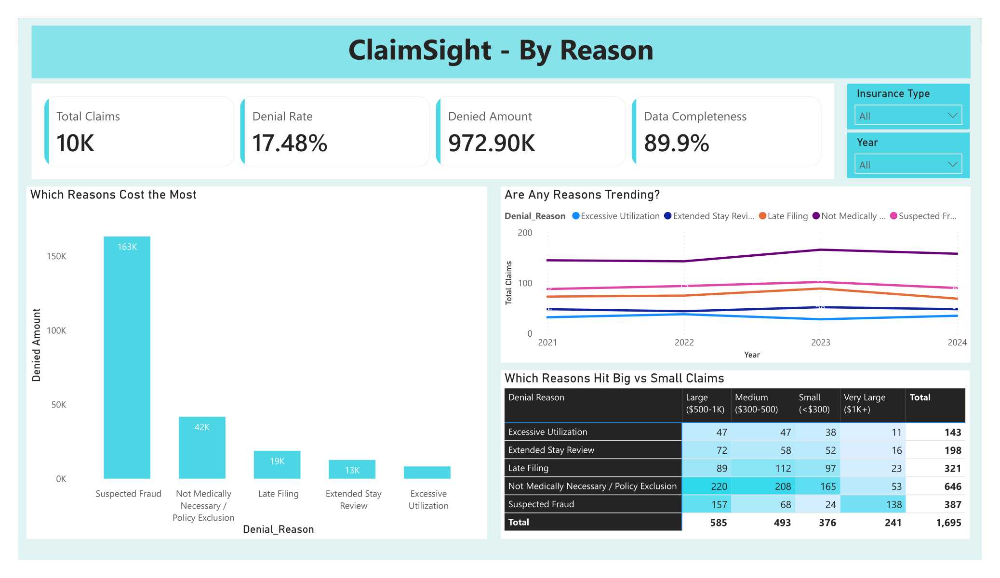
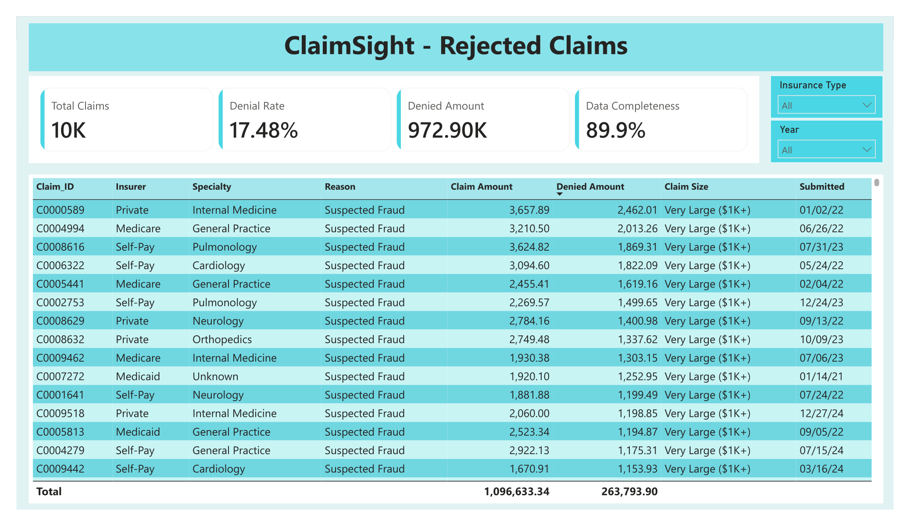

# ClaimSight: Healthcare Claims Denial Analytics

A Power BI dashboard that looks at 10,000 US health insurance claims to figure out where denials happen, why they happen, and where the money actually goes. I built it around a question a clinic billing office deals with constantly: when you only have time to fight some of your denials, which ones should you fight first?

The idea that runs through the whole project is simple. How often a claim gets denied and how much a denial costs you are two separate problems. They usually point at different priorities. So every page is built to show the rate side and the dollar side next to each other, because looking at only one of them leads you to the wrong answer.

## What the five pages cover

The Overview page gives the top level picture and shows which months denials tend to spike.

The By Insurer page compares payers, both by how often they deny and by how many dollars they cost.

The By Procedure page does the same comparison across medical specialties.

The By Reason page digs into why claims get denied and where the real dollar damage sits.

The Rejected Claims page is a row by row table of denied claims. It is also the starting point for a planned second phase, described at the bottom.

Screenshots of each page are in the screenshots folder. The full interactive report is the .pbix file, which opens in the free Power BI Desktop. There is also a PDF export in the exports folder for anyone who just wants to look without installing anything.

## What I found

Denial rate goes up steadily as claims get bigger. Small claims under 300 dollars get denied about 16 percent of the time. Claims over 1,000 dollars get denied about 22 percent of the time. Bigger claim, more scrutiny.

Rate and dollars disagree, and they disagree more than once. Private insurers deny the most often at 17.84 percent, but Medicare has the most denied dollars sitting with it, around 240,000. On the specialty side, Neurology has the highest denial rate at 19.12 percent, but Internal Medicine loses the most money at 195,000, because it simply has far more claims. If you care about approval rate you go after Neurology and Private. If you care about cash flow you go after Internal Medicine and Medicare. They are not the same target.

The fraud finding is the one I keep coming back to. "Not Medically Necessary" is the most common reason a claim gets denied. It shows up on 641 claims, more than any other reason. Suspected Fraud is nowhere near as frequent, but it costs far more, about 163,000 dollars, close to four times the next reason on the list. Per claim, a fraud denial runs around 436 dollars against roughly 66 dollars for a medical necessity denial. That is about six and a half times heavier. And it clusters where the money is. Of all the denials on claims over 1,000 dollars, 57 percent are flagged as suspected fraud. The dashboard shows this three separate ways: the dollar bar chart, the per claim math, and the reason by claim size table. When the same pattern shows up from three angles, I trust it.

Medical necessity denials are the steadiest thing in the whole dataset. They are the top reason for every payer and every specialty, and they barely move year to year. That makes them the most useful thing to attack, because a stable, high frequency problem is something a billing office can actually build a process around.

## Why any of this matters for a billing office

The findings turn into fairly direct advice. Expect big claims to get picked apart, so document the large and fraud prone ones carefully before they ever go out. Rank your appeals by dollars, not by count, because the most common denial is not the most expensive one. And treat medical necessity as a process problem worth solving once, since it is the reason that shows up everywhere and never really changes.

## How I built it

The cleaning was done in Python with pandas. I started from a 10,000 row claims dataset from Kaggle. Missing values were filled in, but I kept a flag on every row I touched so completeness stays measurable, which is where the 89.9 percent data completeness number comes from. I added the fields the analysis needed: a denied flag, a denied amount, a payment ratio, a claim value bucket, an age group, and a rule based denial reason. The bucket cutoffs come from the data itself using percentiles, not from numbers I picked out of the air.

The dashboard is Power BI. It uses a proper date table with a relationship back to the claims so the time based charts work correctly. All the KPIs are custom DAX measures. The five pages share one design so it reads as a single tool, and clicking any chart filters the rest of the page.

A few choices were about not fooling the reader. The data ends on January 26, 2025, so 2025 is only a partial year. Wherever that would make a trend look wrong, I either labeled it or filtered it out. I also filtered out the "Unknown" category that came from filling in missing values, so it never gets mistaken for a real payer or specialty. And I kept axes and denominators honest so nothing looks more dramatic than it is.

## Tools

Python, pandas, Power BI Desktop, DAX, Power Query.

## What is in this repo

The README you are reading sits at the top. The data folder holds the original file and the cleaned output. The notebooks folder has the Python cleaning and exploration work. The powerbi folder has the dashboard file. The screenshots folder has one image per page, and the exports folder has the PDF version of the whole thing.

## What comes next

The Rejected Claims table was built on purpose to be the doorway into a second phase: a small Streamlit app wired to the Claude API that takes any denied claim, explains in plain language why it was denied, and drafts an appeal letter that cites the relevant policy. Right now the dashboard tells you what went wrong. The next phase should help you actually respond to it.

## A note on the data

This uses a public dataset, and the denial reason field is not in the original data. I created it with clear, rule based logic that is written out in the notebooks. The point of the project is the way the analysis is done: separating rate from dollars, checking a finding from more than one direction, and being upfront about data quality. Those habits carry over to real claims data even though this particular dataset is synthetic.
